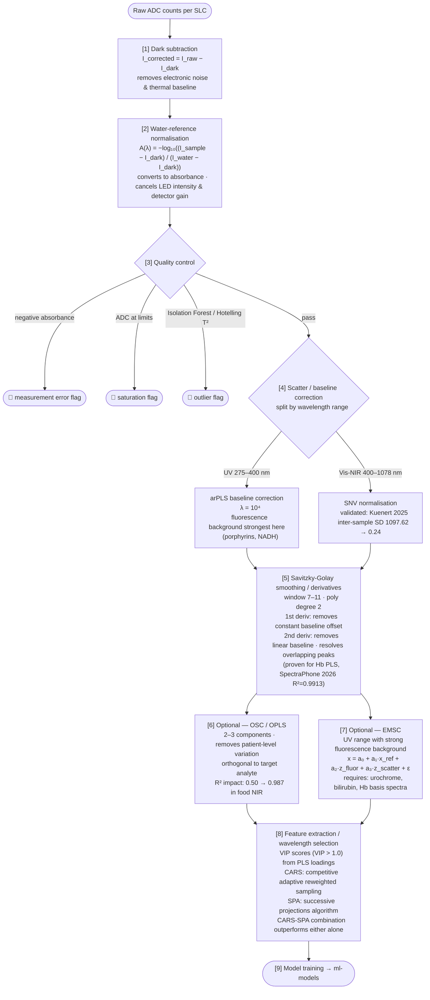

# Signal Processing & Matrix Correction for Jimini Urine Spectroscopy

Evidence-based signal processing pipeline for Jimini LED spectrophotometer + EIS. Covers Beer-Lambert measurement principle, preprocessing methods, matrix corrections (turbidity, dilution, colour, pH), and cross-device calibration transfer.
See also: [[optical-signatures]] [[ml-models]] [[biomarker-panel]] [[feasibility-analysis]]

---

## 1. Measurement Principle

Each measurement produces a **signal level channel (SLC)** encoded as `{sensor}-{emitter}-{amplitude}`. The fundamental transformation is Beer-Lambert:

$$A(\lambda) = -\log_{10}\left(\frac{I_{\text{sample}}(\lambda) - I_{\text{dark}}(\lambda)}{I_{\text{water}}(\lambda) - I_{\text{dark}}(\lambda)}\right)$$

Water-referenced absorbance removes per-measurement LED intensity variation and detector baseline drift. It is the natural starting point for all downstream processing.

**EIS signal:** Low-frequency (10–100 kHz) conductivity provides total ionic strength; impedance at specific frequencies reflects cell membranes, protein binding, and pH.

---

## 2. Signal Processing Pipeline



---

## 3. Preprocessing Methods — Mathematical Detail

### Standard Normal Variate (SNV)

$$x_{\text{SNV}}(\lambda) = \frac{x(\lambda) - \bar{x}}{\sigma_x}$$

Per-spectrum transform. Corrects multiplicative scatter (turbidity, path length variation) and additive offset (dilution, background). **No reference spectrum needed** — applied independently per sample. Mathematically equivalent to MSC when the MSC reference is the dataset mean.

**Validated for LED urine spectroscopy:** Kuenert et al. (2025) showed SNV on 288-channel LED spectra (340–850 nm, n=401 samples) reduced mean per-wavelength SD from 1097.62 to 0.24.

### Multiplicative Scatter Correction (MSC)

$$x_i(\lambda) \approx a_i \cdot \bar{x}(\lambda) + b_i \quad \Rightarrow \quad x_{\text{MSC}}(\lambda) = \frac{x_i(\lambda) - b_i}{a_i}$$

Regress each spectrum against a reference (calibration-set mean). Provides interpretable scatter parameters ($a_i$ = multiplicative, $b_i$ = additive). **Set-dependent** — reference must be stable across instrument calibration periods.

### Extended MSC (EMSC) — For Complex Biological Fluids

$$x_i(\lambda) = a_0 + a_1 \cdot \bar{x}(\lambda) + a_2 \cdot \lambda + a_3 \cdot \lambda^2 + \sum_k e_k \cdot f_k(\lambda) + \varepsilon$$

Adds polynomial baseline terms and known interferent spectra $f_k(\lambda)$ (urochrome, fluorescence background, bilirubin). Critical for UV range where urine autofluorescence confounds absorption measurements.

### arPLS Baseline Correction

Asymmetrically Reweighted Penalized Least Squares. Uses logistic sigmoid weighting to fit a smooth baseline while ignoring spectral peaks. One hyperparameter: λ (smoothness penalty, typical 10²–10⁷). Outperforms airPLS for moderate-SNR conditions.

**BrPLS (Bayesian variant):** State-of-the-art, R² = 0.999 vs 0.9985 for arPLS. No manual threshold tuning. Recommended for UV fluorescence correction when computational cost is acceptable.

### Savitzky-Golay Derivatives

SG 2nd derivative is particularly valuable for urine:
1. Eliminates baseline offset AND slope (varying dilution)
2. Resolves overlapping peaks (discriminates [[creatinin|creatinine]] vs. [[urea]] NIR bands)
3. Combined with SNV: validated for PLS quantification (SpectraPhone 2026)

**Fractional-order SG derivatives** (order α ∈ (0,2)): +17% correlation improvement for chlorophyll estimation vs. integer derivatives — emerging for NIR urine.

---

## 4. Matrix Corrections

### 4.1 Turbidity Correction

**Problem:** Suspended particles (cells, crystals, [[bacteria]]) scatter light at all wavelengths, inflating apparent absorbance.

**Estimation:** At 660–800 nm, urine chromophores have negligible true absorbance → any signal is scatter.

$$A_{\text{scatter}}(\lambda) = \alpha \cdot \exp(-\beta \cdot \lambda)$$

Fit α, β from the 600–800 nm baseline region, then subtract from the full spectrum.

**CIE L\*a\*b\* assessment:** L\* < 89.1 → abnormal turbidity (96% accuracy, AUC = 0.984). CIE b\* correlates with urochrome concentration (τ = 0.708 with osmolality).

**SNV handles mild turbidity** (per-spectrum normalization). For severe turbidity, use EMSC with scatter basis vectors.

### 4.2 Dilution / Hydration Correction

Urine osmolality ranges 50–1200 mmol/kg (24-fold range). All analyte concentrations scale with dilution.

#### Conventional [[creatinin|Creatinine]] Correction (CCRC)

$$A_{\text{norm}} = \frac{[\text{Analyte}]}{[\text{[[creatinin|Creatinine]]}]}$$

**Limitations:** [[creatinin|Creatinine]] varies with muscle mass (↓20–36% in females/elderly), diet, exercise, disease. WHO excludes CRN < 0.3 or > 3.0 g/L → rejects ~20% of samples.

#### V-PFCRC — Variable Power-Functional CRN Correction ⭐

**Best-in-class dilution correction** (Carmine 2025, n = 58,439 samples):

$$A_{\text{corrected}} = A_{\text{raw}} \times \text{CRN}^{-b_{\text{variable}}}$$

where $b_{\text{variable}} = c \cdot \ln(A_{\text{raw}}) + d$ with analyte-specific and sex-specific coefficients c, d.

- Eliminates nonlinear dilution bias across all exposure levels
- Reduces sample rejection rate from 22% to < 1%
- Valid down to CRN ≈ 0.05 g/L
- Requires large reference dataset (≥ 1000 samples) to derive c, d coefficients

#### Specific Gravity Normalization

$$A_{\text{SG}} = A_{\text{raw}} \times \frac{0.024}{\text{SG} - 1.000}$$

Not affected by muscle mass or [[creatinin|creatinine]] physiology. EIS conductivity provides a direct SG surrogate for Jimini.

### 4.3 Colour Correction (Urochrome, Bilirubin)

**Urochrome (urobilin):** Dominant yellow pigment. Broad 400–500 nm absorbance. pH-dependent: peak shifts ~50 nm between pH 5 and pH 8.

**Correction strategies:**
1. EMSC with urochrome reference spectrum: model and subtract urochrome contribution
2. Include as latent variable in PLS/OPLS: let the model learn to orthogonalise against it
3. CIE b\* flagging: samples with b\* > 30 → pre-dilute before measurement

**Bilirubin:** Strong 400–500 nm absorbance (ε ≈ 55,000 L·mol⁻¹·cm⁻¹ at 454 nm). Measure A(454 nm) as bilirubin proxy → subtract scaled reference spectrum.

### 4.4 Inner Filter Effect (IFE) in Fluorescence

When urine absorbs strongly at the excitation or emission wavelength, fluorescence becomes nonlinear.

**Standard correction (Lakowicz):**

$$F_{\text{corrected}} = F_{\text{observed}} \times 10^{(A_{\text{ex}} + A_{\text{em}})/2}$$

Valid for $A_{\text{ex}} < 0.3$. For higher absorbance: dilute 1:2–1:5 with PBS, or use the iterative secondary IFE algorithm.

### 4.5 pH Effects

pH shifts urobilin absorbance by ~50 nm and affects indoxyl sulfate fluorescence (enhanced at pH > 7 due to oxidation).

**Correction options:**
1. Buffer standardisation (add 1/9 volume of 0.5M [[phosphate]] pH 7.0)
2. Include pH as model covariate
3. EMSC with pH-state reference spectra

---

## 5. Cross-Device Calibration Transfer

### 5.1 The Problem

Two Jimini units produce different spectra from the same sample due to:
- LED peak wavelength shift (±2–5 nm)
- LED intensity variation (±10–20%)
- Detector quantum efficiency variation (2–5% per channel)
- Optical path differences

### 5.2 Recommended Methods (Prioritised)

#### Priority 1: Water-Reference + SNV (Zero overhead)

Already built into the measurement protocol. Water-reference absorbance cancels LED intensity differences. SNV handles remaining scale differences. **Removes ~60–70% of inter-unit variation.**

#### Priority 2: Per-Channel Gain Correction (Factory calibration)

Measure 3–5 reference solutions on each new unit during manufacturing QC. Fit per-channel multiplicative gain factors. Store in device firmware. Reduces systematic errors to < 1–2%. For LED-based sensors this reduces to a **diagonal DS matrix** — very robust with few transfer samples.

#### Priority 3: MVG Augmentation (Training-time, best ROI) ⭐

Leopold-Kerschbaumer et al. (2025) demonstrated that **17 paired reference measurements** (not biological samples) across 2 devices enable effective cross-device model generalisation via multivariate Gaussian augmentation:

```python
# Cross-device covariance from paired reference measurements
diff = X_device1 - X_device2
Sigma_cross = np.cov(diff.T)

# Augment training: for each sample, generate synthetic device variants
for x in X_train:
    synthetic = np.random.multivariate_normal(mean=x, cov=Sigma_cross, size=100)
    X_augmented.append(synthetic)
```

Cross-device AUC improved from 0.81–0.86 → 0.90–0.92 (matching within-device performance) on blood IR data. **Requires only reference solutions, no patient urine.**

#### Priority 4: CORAL (Post-deployment, unsupervised)

Align covariance matrices of source (training) and target (new device) distributions:

$$X_{\text{aligned}} = (X_{\text{source}} - \mu_s) \cdot C_s^{-1/2} \cdot C_t^{1/2} + \mu_t$$

No paired samples needed — just unlabelled target-device spectra. Good for correcting slow drift over time.

#### Priority 5: Domain Adversarial NN (Advanced, fleet-scale)

DANN with gradient-reversal layer forces device-invariant feature learning. Requires ~20+ deployed devices with sufficient unlabelled data. **Warning:** "worst scanner syndrome" — forcing domain invariance can destroy information if devices have inherently different SNR.

### 5.3 Method Comparison

| Method | Paired samples | Handles gain | Handles offset | For Jimini |
|---|---|---|---|---|
| Water-ref + SNV | None | ✅ | ✅ | **Start here** |
| Per-channel gain | 3–5 ref solutions | ✅ | Partial | **Factory step** |
| MVG augmentation | 15–20 ref solutions (2–3 devices) | ✅ | ✅ | **Best ROI** |
| CORAL | None (unlabelled target data) | ✅ | ✅ | **Post-deploy** |
| DS/PDS | 6–10 paired samples | ✅ | ✅ | If paired available |
| DANN | None (domain labels) | ✅ | ✅ | Fleet-scale |

---

## Key Detection Challenges

| Challenge | Impact | Mitigation |
|---|---|---|
| Complex UV background | All UV analytes ([[creatinin\|creatinine]], albumin, [[uric-acid\|uric acid]]) | Derivative spectroscopy, PLS regression |
| Water dominance in NIR | [[[[urea]]\|Urea]], [[creatinin\|creatinine]], ions | High-SNR instrument, robust PLS, temperature control |
| No chromophore on ions | Na, K, Cl, Mg, [[phosphate]] | EIS with ISE or conductivity sensor |
| Weak [[glucose]] signal | [[[[glucose]]\|Glucose]] | GOx-EIS + ML full-spectrum fingerprinting |
| Particle overlap ([[red-blood-cells\|RBC]]/[[white-blood-cells\|WBC]]/epith.) | Cellular classification | MALS + trained ML classifier |
| Urochrome/bilirubin background | All visible-range analytes | 2nd derivative, PCA outlier removal |
| Temperature drift | All measurements | Peltier-controlled cell, ±0.1°C tolerance |
| Sample dilution variability | All concentrations | Normalise to [[creatinin\|creatinine]] (ACR, PCR ratios) |

---

## Sources

| Reference | Notes |
|---|---|
| Kuenert et al. *Sci Rep* 2025. DOI: 10.1038/s41598-025-92802-2 | SNV on LED urine spectra, n=401 |
| SpectraPhone *Sci Rep* 2026. DOI: 10.1038/s41598-026-38307-y | PLS 2nd-derivative hematuria R²=0.99 |
| Carmine TC. *Sci Rep* 2025. PMC11782553 | V-PFCRC best-in-class dilution correction |
| Leopold-Kerschbaumer et al. *Anal Chem* 2025. PMC12096352 | MVG cross-device augmentation |
| Sun et al. *arXiv* 2016. 1612.01939 | CORAL domain adaptation |
| Afseth & Kohler. *Chemom Intell Lab Syst* 2012;117:92–99 | EMSC tutorial |
| Baek et al. *Analyst* 2015;140:250–257 | arPLS baseline correction |
| Wold et al. *Chemom Intell Lab Syst* 1998;44:175–185 | Orthogonal Signal Correction |
| Tang et al. *Analyst* 2014. DOI: 10.1039/c4an00837e | CARS-SPA combination |
| See [[literature]] for full citation list | |

## Gaps

- EMSC interferent reference spectra library (urochrome, bilirubin, haemoglobin) for Jimini not yet compiled — needed before EMSC can be applied in production
- Optimal arPLS λ hyperparameter for Jimini UV range (275–400 nm) not experimentally determined; literature value 10⁴ used as starting point
- Fractional-order SG derivatives: promising (+17% improvement in NIR literature) but not yet validated on urine LED spectra
- V-PFCRC coefficients (c, d per analyte): require ≥ 1000 paired Jimini + reference lab samples to fit — not yet available
- MVG cross-device augmentation validated on blood IR data; urine-specific validation on Jimini units pending
- IFE correction threshold (A_ex > 0.3): Jimini path length not specified — need to characterise typical absorbance range to determine when IFE correction is required
