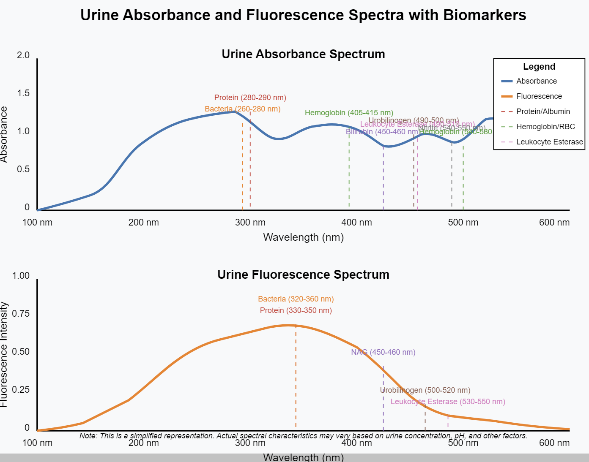

# Urine Biomarkers Detectable by Photospectrometry

| Biomarker | Absorbance Wavelengths (nm) | Fluorescence Wavelengths (nm) | Description |
|-----------|------------------------------|-------------------------------|-------------|
| Urobilinogen | 490-500 | 500-520 | Product of bilirubin reduction; elevated in liver disease and hemolytic conditions |
| Bilirubin | 450-460 | Non-fluorescent | Bile pigment; indicator of liver dysfunction or biliary obstruction |
| Hemoglobin/Red Blood Cells | 405-415, 540-580 | Non-fluorescent | Indicates bleeding in urinary tract; key marker of inflammation |
| Myoglobin | 405-410, 555-565 | Non-fluorescent | Released from damaged muscle; can indicate trauma or rhabdomyolysis |
| Leukocyte Esterase | 490-510 | 530-550 | Enzyme from white blood cells; strong indicator of infection or inflammation |
| Nitrite | 540-550 | Non-fluorescent | Produced by bacteria that reduce nitrate; indicates bacterial infection |
| Protein (Albumin) | 280-290 | 330-350 | Elevated in inflammation, infection, kidney damage |
| N-acetyl-β-D-glucosaminidase (NAG) | 405-410 | 450-460 | Lysosomal enzyme; marker of tubular epithelial cell damage |
| Pyuria (WBCs) | 280-290 | 330-350 | White blood cells in urine; direct marker of infection or inflammation |
| Bacteria | 260-280 | 320-360 | Direct measurement of bacterial presence; indicates infection |
| Myeloperoxidase (MPO) | 410-430 | Non-fluorescent | Enzyme released by neutrophils; inflammatory marker |
| Interleukin-6 (IL-6) | Detectable with labeled antibodies | Varies with label | Pro-inflammatory cytokine; marker of inflammation |
| Interleukin-8 (IL-8) | Detectable with labeled antibodies | Varies with label | Chemokine; recruits neutrophils to infection sites |
| Lactoferrin | 280-295 | 320-360 | Iron-binding protein; elevated in inflammation and infection |
| Urine Neutrophil Gelatinase-Associated Lipocalin (NGAL) | 280-290 | 330-350 | Protein released during kidney tubular damage; marker of acute kidney injury |
| C-Reactive Protein (CRP) | Detectable with labeled antibodies | Varies with label | Acute phase protein; systemic marker of inflammation |
| Prostaglandin E2 | 230-240 | Non-fluorescent | Inflammatory mediator; elevated in inflammatory conditions |

