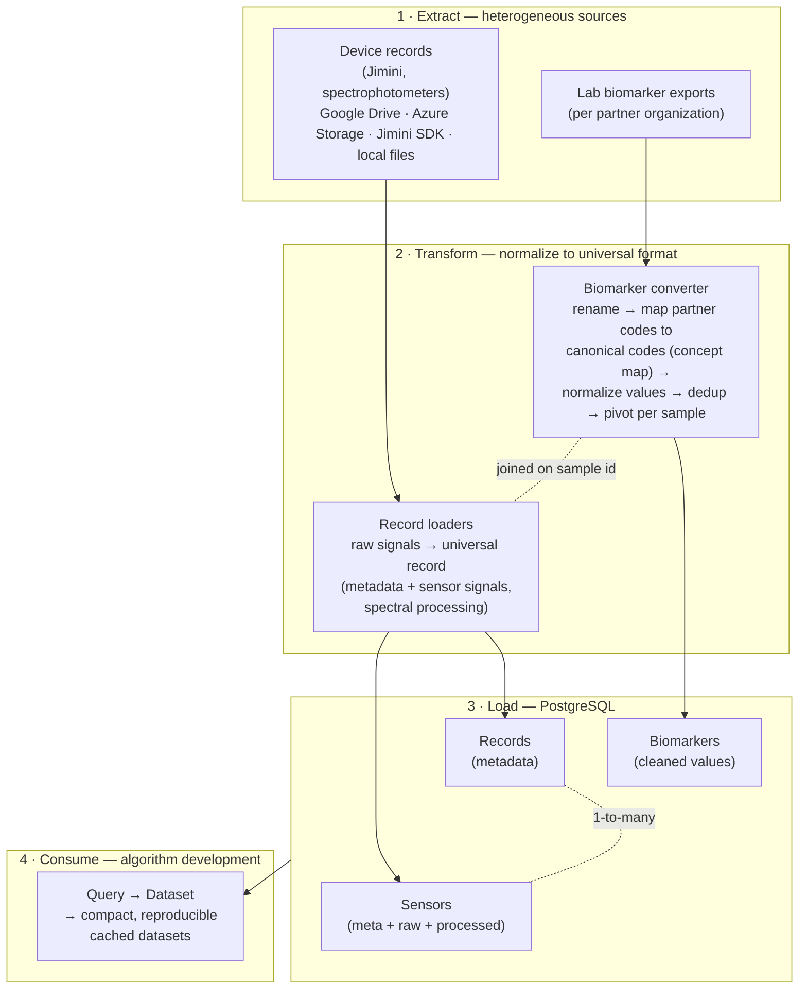
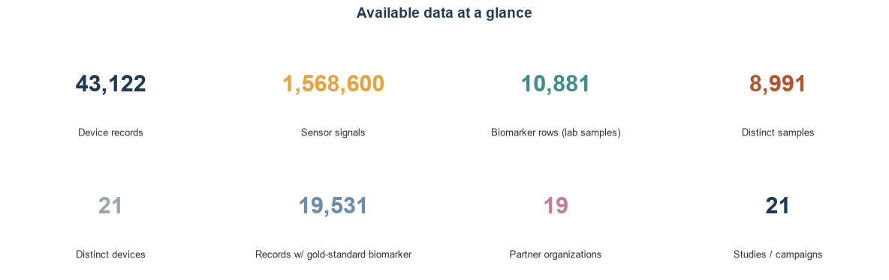
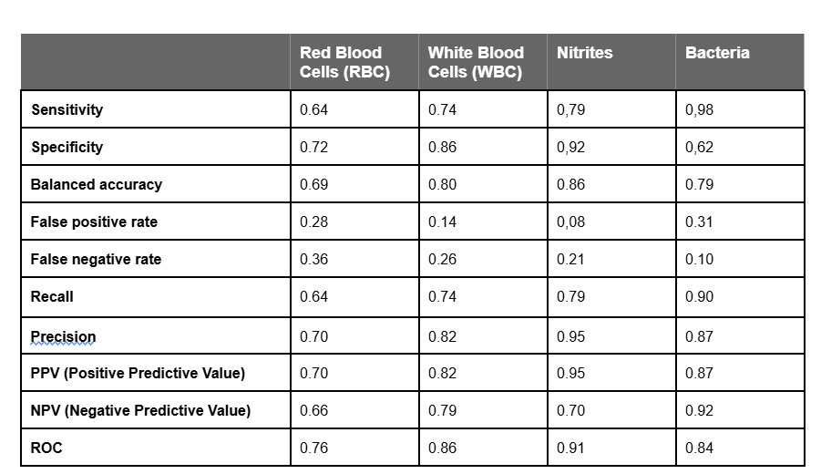

# Data Science Vision and Scope

The Jimini device generates complex optical and electrical signals that require rigorous data science to turn raw measurements into clinically meaningful biomarker estimates. The Data Science team underpins every stage of this process — from hardware specification to production deployment — ensuring that algorithms are scientifically grounded, reproducible, and ready for regulatory scrutiny.

The Data Science team is involved in the following steps of the development of the Jimini medical device:

1. Literature reviews
	- Understanding optical and electrical signals, and the methods for preprocessing, processing, and modeling for biomarker estimation.
	- Scientific grounding of biomarker estimation methods.
2. Device development support
	- Defining hardware specifications to obtain signals that maximize information on target biomarkers.
	- Assessment of signal quality, inter-device variability, and conformity to specifications.
3. Data normalization and storage
	- Creating and maintaining a normalized database of signals, metadata, and biomarkers.
4. Algorithm development
	- Real-time tracking of scientific studies and automatic estimation during internal trials.
	- Development of biomarker estimation algorithms from Jimini signals.
5. Production
	- Creating and managing biomarker estimation endpoints in production.
	- Validation of devices post-production, assessing conformity to product specifications.
6. Post-market performance tracking
	- Continuous monitoring of deployed device and algorithm performance to detect drift and ensure sustained accuracy in the field.

# Data Science SDK

To support these activities, we developed a proprietary Software Development Kit (SDK) that standardizes data from all device types and formats into a single unified pipeline, enabling consistent algorithm development, reproducible experiments, and reliable quality assessment across all studies and production deployments.

The SDK is organized into several repositories. A first set of repositories handles **loading and normalization**, with dedicated loaders for each data provider that ingest heterogeneous source formats and map them onto the universal record format. A second set provides **transformers** — modular processing units that implement signal processing, spectral-specific transformations, calibrations, and normalization. Each transformer is programmed as a self-contained, interchangeable module with a common interface, so transformers can be freely composed, reordered, and swapped. This modular design lets us assemble them into both machine learning and deep learning pipelines, keeping every step of the data flow explicit, reusable, and reproducible across experiments and production.

Beyond data handling and modeling, the SDK provides **statistical functions** to assess model performance and to characterize interactions with metadata and biomarkers — for example, identifying confounders or quantifying how predictions vary across patient subgroups. It also includes **interpretability tools** that reveal where a model is looking within its inputs, helping us understand and scientifically ground the algorithms rather than treating them as black boxes. Finally, the SDK packages **Quality Test Protocols (QTPs)** and a collection of notebooks used to validate algorithms and to share results, figures, and analyses with the other teams.

# Data

The Data Science team handles two main types of data:

- **Device records** contain signals and associated data. These records can originate from Jiminis, spectrophotometers, and other external or research devices. All records are normalized through loaders into a universal format, with an ontology used to resolve data heterogeneity across sources.
- **Biomarkers** originate from automatic exports from our partners or from values recorded by our technicians. They are normalized into a common format for consistent processing.

An ETL (Extract, Transform, Load) pipeline integrates and processes records and biomarkers into a unified database.

To maximize the security of Protected Health Information (PHI), the Data Science database contains the minimum necessary amount of information required to estimate biomarker concentrations.
The data minimization principle — collecting only the minimum necessary PHI — aligns with Article 10 of the EU AI Act, which mandates that training data for high-risk AI systems respect data protection and privacy requirements.

## ETL

USense integrates data from multiple heterogeneous sources — device records, lab biomarker exports, and experiment-specific files — into a single, normalized, and queryable database. A custom ETL pipeline processes and harmonizes all incoming data, assigns unique identifiers to each record to avoid conflicts across organizations and studies, and stores the result in a structured PostgreSQL database. This ensures full consistency, traceability, and reproducibility across all algorithm development and production workflows.

The database contains three tables:

| Table          | Contents                                                      |
| -------------- | ------------------------------------------------------------- |
| **Records**    | Metadata for each record                                      |
| **Sensors**    | Sensor metadata, raw data, and processed data for all records |
| **Biomarkers** | Exported and cleaned biomarker values                         |

This structure allows querying records from a given study, filtering by device, date, or the presence of a gold-standard biomarker value.

The pipeline is organized into four stages — extraction of raw data from heterogeneous sources, transformation into a universal format, loading into the PostgreSQL database, and consumption by algorithm development:

Each record is assigned a unique identifier on load, and records and biomarkers are joined on a shared sample key, so the same query interface serves both algorithm development and production.

## Available data
As of 2026-06-04, the Data Science database holds 43,122 device records (1,568,600 individual sensor signals) collected since 2025-03-25 across 19 partner organizations and 21 studies/campaigns, using 21 Jimini devices. Of these, 37,946 are urine measurements (the clinical target), and 19,531 records (45%) are paired with a gold-standard lab biomarker drawn from 10,881 labelled samples. The labelled cohort is 57% female / 43% male with a median age of 58 years, and includes 10,832 samples with an infection label.

# Biomarker Estimation

The Jimini device developed by USense is a pen-like probe that can be dipped into a liquid sample (urine, water, or air). Via a companion app, it drives onboard emitters and reads signals from multiple sensors. The goal is to measure urine biomarker concentrations non-invasively — enabling point-of-care diagnostics that could replace or complement laboratory testing, reducing time-to-result and improving access to care. From an algorithm development standpoint, this translates to predicting a continuous, categorical, or binary concentration of a biomarker from a matrix of electrical and optical signals.

## Overall Strategy

#### Explainability and Simplicity

The strategy is to reach the simplest model that solves the problem. For optical biomarker estimation, we start from naive, science-rooted methods — for example, following the Beer-Lambert law — and progressively apply signal processing and normalization techniques to address sample and device variability. For modeling, we begin with interpretable machine learning techniques (PCA for feature selection, Logistic Regression for classification). Deep learning methods are only adopted when simpler approaches are insufficient and enough data is available. This preference for simplicity means our models are more auditable, easier to validate with regulators, and faster to iterate on.
This "simplest model first" philosophy directly supports the EU AI Act's requirement (Article 13) that high-risk AI systems be sufficiently transparent for users and notified bodies to understand and verify their outputs.

#### Science-Backed Algorithms

Algorithm development starts with understanding the expected impact of the target biomarker on the signals. In coordination with the science team, literature reviews drive device development as well as algorithm design — targeting specific optical wavelengths to maximize biomarker response. This scientific grounding strengthens the defensibility of our IP and supports faster regulatory approval by aligning algorithmic choices with established biochemical mechanisms.

#### Determinism

All developed algorithms are deterministic: for a given input signal, the algorithm will always produce the same output. The hardware is designed to minimize variability between devices, and the Data Science codebase contains dedicated functions to reduce inter- and intra-device signal variation on the same sample. This reproducibility is essential for regulatory submissions and clinical validation.
Deterministic algorithms satisfy the EU AI Act's requirement (Article 9) for risk management and consistent, predictable behavior in high-risk AI systems — a key criterion for CE marking and clinical validation.

#### Input Validation

Algorithms are designed to accept only specific, well-defined input data. The models actively reject input signals that do not meet their requirements — including low signal levels, metadata issues (wrong sample type), incompatible hardware or firmware versions, and electroimpedance errors (e.g., the device not recording in urine, or insufficient liquid level). When requirements are not met, error codes are returned to the backend and mobile application rather than producing an unreliable result.
This input validation mechanism aligns with the EU AI Act's Article 9 requirements for risk management: the system actively detects out-of-scope conditions and refuses to operate rather than producing potentially harmful outputs.

#### Traceability

Algorithm inputs and outputs are stored in our backend for every production call. Since gold-standard biomarker values are not routinely available in production settings, direct accuracy monitoring is not always possible; instead, we track signal quality metrics, output distributions, and error rates to detect drift and flag anomalies. This traceability infrastructure enables post-market surveillance and supports regulatory audit requirements.
Full traceability of algorithm inputs and outputs supports compliance with the EU AI Act's Article 12, which requires high-risk AI systems to automatically log events throughout their lifecycle to enable post-market monitoring and auditability.

## Algorithm Development

Algorithm development follows a structured, reproducible workflow that takes a target biomarker from a raw query to a validation-ready candidate model. Each stage is logged and versioned so that any result can be reproduced and audited.

- **Dataset creation.** Records and gold-standard biomarker values are queried from the Data Science database for a given biomarker and frozen into a compact, versioned, reproducible dataset, so every experiment runs against an immutable, traceable snapshot.
- **Splitting.** Data are partitioned into training and test sets at the **sample level**, guaranteeing that no sample appears in both, which prevents data leakage and yields honest generalization estimates.
- **Exploratory analysis.** Descriptive overviews characterize the problem, the signals, and the biomarker distribution (including class imbalance and potential confounders), informing the modeling strategy before any model is trained.
- **Preprocessing pipeline.** Signals are passed through a composable chain of SDK transformers — signal processing, spectral transformations, calibration, and normalization — to reduce sample and inter/intra-device variability and to expose the biomarker-relevant information.
- **Modeling, simplest-first.** Starting from science-rooted baselines (e.g. Beer-Lambert) and interpretable models (PCA, Logistic Regression), algorithms are trained, hyperparameter-optimized via cross-validation, and tracked with a dedicated experiment-tracking service (MLflow). More complex methods are introduced only when simpler ones prove insufficient. Threshold-optimization techniques align operating points (sensitivity/specificity) with product specifications.
- **Reporting and interpretability.** For each candidate, reports document prediction performance against product-spec metrics, residual error, potential confounders (other biomarkers that could degrade accuracy), and interpretability analyses showing where the model draws its signal — keeping models auditable rather than black-box.
- **Validation.** The selected, versioned candidate undergoes a formal validation stage with the science team, after which it is handed off to the production/deployment workflow.

## Automated Research (AutoML)

To accelerate algorithm development, we built an in-house **autoresearch system** that turns our modular SDK into a self-driving experimentation engine. The system automatically assembles the SDK's building blocks — signal-processing transformers, feature extractors, and models — into complete candidate pipelines, trains each one to predict the target biomarker, and records its performance. An **AI agent then reads and interprets the results of every run**, reasons about what worked and what did not — grounded in the underlying biology and signal physics — forms the next hypothesis, and decides which pipeline to try next. Every experiment is logged, and the system **tracks the evolution of performance over time**, so progress toward the clinical target (balanced accuracy, sensitivity, and specificity each above 80%) is continuously visible and fully traceable.

Crucially, the process is **semi-automated, not a black box**. The system runs in short autonomous bursts, but a data scientist **reviews the consolidated reports every five to ten runs**, validates the agent's conclusions, and **updates the research objectives and strategy** before the next burst — for example, redirecting the search to a different signal family when a line of attack stalls. This human-in-the-loop checkpoint keeps the search scientifically grounded and aligned with product requirements, combining the speed and tirelessness of automated experimentation with expert oversight and accountability. The result is faster iteration toward validated models, with a complete, auditable record of how each model was reached. This continuous human oversight also supports the EU AI Act's Article 14 requirement that high-risk AI systems remain under meaningful human control.

## Compute Service and MLOps

The Data Science algorithms are exposed using **Azure Functions**, enabling controlled access and horizontal scalability. The Azure Functions can be called from a local computer or from the cloud service after authentication. Examples of exposed functions include biomarker estimation from one or more Jimini records and quality estimation of a given record.

The platform is deployed directly from VS Code, following successful unit tests and Qualification Test Protocols (QTPs). Deployment follows a controlled two-stage process: first into a staging environment, then into production after approval by cloud team integration tests — ensuring that no unvalidated changes reach clinical users.
This staged deployment process supports the EU AI Act's Articles 9 and 17 requirements for quality management systems governing AI system updates and post-deployment control.

A standardized **API** allows calling one or several biomarker estimation algorithms, providing the record(s) and requested analyses. The service responds in a format adapted from the Fast Healthcare Interoperability Resources (FHIR) standard, ensuring interoperability with clinical information systems.

The service is hosted by USense's cloud infrastructure and inherits its firewall and security settings. The current architecture supports a single endpoint per biomarker, with built-in capacity to add redundancy and scale to any number of devices.

Our architecture was designed from the ground up to meet the requirements of high-risk AI systems under the EU AI Act and the In Vitro Diagnostic Regulation (IVDR) — combining deterministic algorithms, input validation, full traceability, staged deployment, and PHI minimization into a cohesive, audit-ready system.

## Current performance of deployed algorithms
